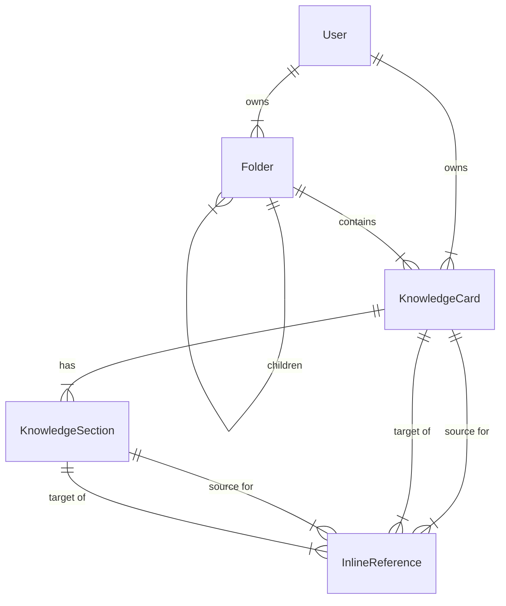

# Data Models

The application uses **Prisma ORM** with an **SQLite/LibSQL** compatible database. The schema is defined in `prisma/schema.prisma`.

## Entity Relationship Diagram (ERD) Description

The core data structure revolves around **Users** who own **Folders** and **KnowledgeCards**. Cards contain **KnowledgeSections**, and **InlineReferences** connect these elements.

## Models

### User (`users`)
Represents a registered user of the system.

- **id**: UUID (PK)
- **email**: String (Unique)
- **theme**: UI Theme preference ('light'/'dark')
- **createdAt**: Timestamp

### Folder (`folders`)
Hierarchical container for organizing content.

- **id**: UUID (PK)
- **name**: Folder name
- **parentId**: Self-reference for nesting (Nullable)
- **order**: Sorting capability
- **userId**: Owner reference

### KnowledgeCard (`knowledge_cards`)
The primary unit of information/content.

- **id**: UUID (PK)
- **title**: Card title
- **summary**: Optional description
- **folderId**: Container reference
- **userId**: Owner reference

### KnowledgeSection (`knowledge_sections`)
Content blocks within a knowledge card. Likely maps to EditorJS blocks or logical sections.

- **id**: UUID (PK)
- **contentType**: Type of content (default "text")
- **content**: The actual content payload
- **order**: Sequence within the card

### InlineReference (`inline_references`)
Manages bidirectional links and highlighted text connections between cards and sections.

- **id**: UUID (PK)
- **sourceCardId / sourceSectionId**: Where the link originates (the text being linked).
- **targetCardId / targetSectionId**: What is being referenced.
- **highlightedText**: The specific text that acts as the anchor.
